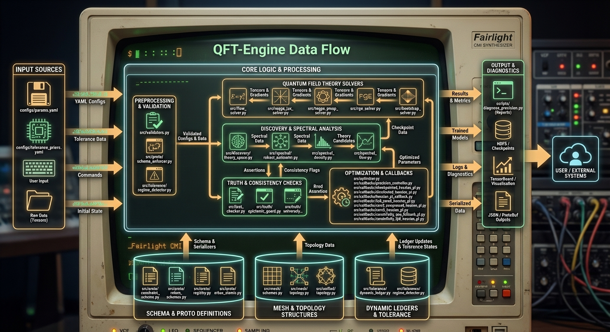

<div align="center">

# QFT-Engine

### High-performance verification framework for computational QFT workflows

<p>
  A research-grade engine for symbolic consistency checks, renormalization flow analysis,
  spectral methods, Regge trajectory solving, bootstrap experiments, and distributed Hessian telemetry.
</p>

<p>
  
  
  
  
  
  
</p>

</div>

---

## Overview

**QFT-Engine** is a modular verification and analysis framework for advanced theoretical and numerical physics workflows.

It brings together:

- symbolic validation of formal constraints
- renormalization group and flow-based solvers
- spectral and dispersive analysis
- bootstrap and Regge-trajectory methods
- distributed Hessian estimation and precision control
- schema-enforced outputs, device-mesh abstraction, and adaptive tolerance governance

This repository is best understood as a **verification stack** for research computation — not a consumer-facing application, but an extensible engine for running, testing, and auditing specialized numerical physics pipelines. 

---

## Architecture


<p align="center">
  <em>End-to-end data flow across validation, solver execution, spectral analysis, topology coordination, logging, serialization, and downstream system output.</em>
</p>

<p align="center">
  
</p>
---

## Why this project stands out

<table>
  <tr>
    <td valign="top" width="33%">
      <h3>Physics-aware computation</h3>
      <p>Built around domain-specific solver families including RGE, spectral, bootstrap, and Regge workflows rather than generic ML-only infrastructure.</p>
    </td>
    <td valign="top" width="33%">
      <h3>Modern execution stack</h3>
      <p>Combines NumPy, SciPy, JAX, PyTorch Lightning, DeepSpeed, TensorBoard, and distributed execution patterns in one codebase.</p>
    </td>
    <td valign="top" width="33%">
      <h3>Governed outputs</h3>
      <p>Schema enforcement, mesh abstraction, and tolerance ledgers provide structural validation, execution coordination, and reproducibility support.</p>
    </td>
  </tr>
</table>

---

## Core capabilities

### Numerical and solver systems
- **RGE solving** for renormalization-flow experiments
- **Flow-based solvers** for spectral and dynamical analysis
- **Discretized bootstrap routines** for constrained amplitude workflows
- **Regge trajectory solvers** across standard, `vmap`, `pmap`, and `shard_map` execution paths
- **JAX Hessian estimation** with quantized variants and distributed support

### Validation and consistency tooling
- symbolic BRST-style verification
- residual and predicate validation
- spectral consistency checks
- runtime schema enforcement for structured solver outputs

### Infrastructure and execution layers
- JAX and PyTorch unified topology abstractions
- tolerance priors and adaptive ledger tracking
- PyTorch Lightning callbacks for Hessian telemetry, ZeRO-3, FP8, and CPU fallback
- profiling, TensorBoard, and cloud deployment scripts

These capabilities are reflected directly in the `src/`, `configs/`, `scripts/`, and `tests/` layout of the repository. 

---

## Repository structure

```text
QFT-Engine/
├── configs/
│   ├── params.yaml
│   └── tolerance_priors.yaml
├── docker/
│   └── Dockerfile
├── scripts/
│   ├── deploy_gce.sh
│   ├── deploy_profiler_gce.sh
│   ├── deploy_universal.sh
│   ├── diagnose_precision.py
│   ├── launch_tensorboard_proxy.sh
│   └── run_suite.sh
├── src/
│   ├── bootstrap_solver.py
│   ├── brst_checker.py
│   ├── flow_solver.py
│   ├── hessian_jax.py
│   ├── hessian_qjax.py
│   ├── optimizer.py
│   ├── regge_bootstrap.py
│   ├── regge_jax_solver.py
│   ├── regge_pmap_solver.py
│   ├── regge_shard_map.py
│   ├── regge_vmap_solver.py
│   ├── rge_solver.py
│   ├── spectral_density.py
│   ├── spectral_flow.py
│   ├── unified_topology.py
│   ├── validators.py
│   ├── callbacks/
│   ├── discovery/
│   ├── mesh/
│   ├── proto/
│   ├── spectral/
│   ├── tolerance/
│   └── truth/
├── tests/
└── .github/workflows/


⸻

Key subsystems

1. Solver layer

The solver surface spans multiple computational styles and execution models:
	•	src/rge_solver.py
	•	src/flow_solver.py
	•	src/spectral_flow.py
	•	src/bootstrap_solver.py
	•	src/regge_bootstrap.py
	•	src/regge_jax_solver.py
	•	src/regge_vmap_solver.py
	•	src/regge_pmap_solver.py
	•	src/regge_shard_map.py
	•	src/hessian_jax.py
	•	src/hessian_qjax.py

This design suggests a repo optimized for comparing methods, scaling execution paths, and validating behavior across both classical and accelerated numerical workflows.

2. Schema and serialization layer

The src/proto/ package provides:
	•	constraint schemas
	•	registries
	•	return-schema definitions
	•	schema enforcement
	•	serializers
	•	atomic checkpoint support

That gives the project a structured contract layer around solver outputs instead of relying on loose dictionaries alone.

3. Mesh and topology layer

The src/mesh/ package provides:
	•	topology abstractions
	•	execution schemes
	•	unified mesh coordination

This makes the codebase more execution-aware than a typical research repo and positions it better for distributed and cross-framework workflows.

4. Tolerance governance

The src/tolerance/ package and configs/tolerance_priors.yaml indicate an explicit system for:
	•	tolerance baselines
	•	bounded adaptation
	•	regime detection
	•	residual-aware control

That is a strong architectural signal: numerical thresholds are treated as managed system state rather than hidden constants.

5. Callback and distributed telemetry layer

The callback set includes:
	•	checkpointed Hessian paths
	•	distributed Hessian monitoring
	•	ZeRO-3 variants
	•	FP8 variants
	•	CPU fallback variants
	•	precision control

This gives the repo serious experimentation and runtime-observability value for large-scale or precision-sensitive workloads.

⸻

Installation

Prerequisites
	•	Python 3.10+
	•	pip
	•	optional GPU / multi-device environment for advanced execution paths
	•	Docker for containerized runs

Install dependencies

python -m pip install --upgrade pip
pip install -r requirements.txt

The repository requirements include NumPy, SciPy, JAX, pytest, PyYAML, PyTorch, PyTorch Lightning, TensorBoard, Google Cloud Storage support, DeepSpeed, PyArrow, and Pydantic.

Optional package sometimes used directly

pip install sympy


⸻

Quick start

Run the full verification suite

bash scripts/run_suite.sh

Freeze adaptive tolerances for deterministic replay

bash scripts/run_suite.sh --freeze --audit-verify

Run tests directly

pytest tests/ -v

Build and run with Docker

docker build -t qft-engine -f docker/Dockerfile .
docker run --rm qft-engine

The repo ships both a test wrapper and a Dockerfile for reproducible execution.

⸻

Example workflows

JAX sharded Regge execution

import jax.numpy as jnp
from src.regge_shard_map import ShardedReggeSolver

solver = ShardedReggeSolver(N_t=256)
delta = jnp.zeros(256) + 0.05

trajectory = solver.scan_regge_trajectory_sharded(delta)
certificate = solver.verify_fakeon_virtualization(trajectory)

print(certificate["status"])

Precision diagnostics

python scripts/diagnose_precision.py

TensorBoard helper

bash scripts/launch_tensorboard_proxy.sh

Cloud-oriented execution

export BUCKET="your-verify-bucket"
bash scripts/deploy_gce.sh


⸻

Configuration

configs/params.yaml

This file contains the main runtime controls for:
	•	roadmap constants
	•	solver tolerances
	•	iteration limits
	•	checkpoint interval
	•	precision target
	•	high-level assumptions

configs/tolerance_priors.yaml

This file defines tolerance policies for subsystems such as:
	•	rge_atol
	•	hessian_pl
	•	bootstrap_unitarity
	•	regge_pole

Together these files form the numerical control plane for the engine.

⸻

Testing strategy

The test suite spans more than a simple smoke check. Current test coverage includes:
	•	regression behavior
	•	flow fixed-point checks
	•	bootstrap and JAX integration
	•	spectral representation and robustness
	•	nonperturbative unitarity checks
	•	Regge distributed execution
	•	tolerance ledger validation
	•	memory fallback paths
	•	profiler and compression integration
	•	GCE and multi-device integration

Representative test files include:
	•	test_bootstrap_jax.py
	•	test_flow_fixed_point.py
	•	test_nonperturbative_unitarity.py
	•	test_regge_pl_integration.py
	•	test_shardmap_zero3_integration.py
	•	test_tolerance_ledger.py
	•	test_robust_spectral.py

This is one of the repo’s strongest qualities: the architecture is accompanied by a substantial verification surface.

⸻

Included operational tooling

Local and CI execution
	•	scripts/run_suite.sh

Precision and runtime inspection
	•	scripts/diagnose_precision.py

Profiling and visualization
	•	scripts/launch_tensorboard_proxy.sh
	•	scripts/deploy_profiler_gce.sh

Cloud deployment
	•	scripts/deploy_gce.sh
	•	scripts/deploy_universal.sh

GitHub Actions
	•	.github/workflows/quft-verify.yml

This gives the project a strong “research + systems” identity rather than a standalone notebook-style workflow.

⸻

Technology stack

<div align="center">


Area	Tools
Numerical computing	NumPy, SciPy, JAX
ML / distributed	PyTorch, PyTorch Lightning, DeepSpeed
Validation	Pydantic
Storage / serialization	PyYAML, PyArrow
Testing	pytest
Observability	TensorBoard
Packaging / runtime	Docker

</div>


⸻

Design philosophy

QFT-Engine appears to be organized around a few clear principles:

Structured computation

Solver output is not treated as an afterthought. The repo includes schema, registry, serializer, and checkpoint layers to keep computational results traceable and structured.

Execution-aware research code

The presence of vmap, pmap, shard_map, callback variants, mesh abstractions, and deployment scripts shows that scalability and runtime behavior are first-class concerns.

Verification over hype

The repository leans heavily into tests, tolerances, validations, and explicit infrastructure around residuals and execution modes.

Modular extension

Subsystems are separated cleanly enough that contributors can extend:
	•	solver implementations
	•	validation layers
	•	topology backends
	•	tolerance policies
	•	callback instrumentation

⸻

Ideal use cases

This repository is a strong fit for people who want to:
	•	prototype or extend computational QFT verification workflows
	•	experiment with JAX-native and distributed solver implementations
	•	validate numerical routines with reproducible tests and tolerances
	•	build infrastructure around schema-validated scientific computation
	•	explore precision-sensitive training or Hessian-monitoring workflows

⸻

Contributing

Contributions are easiest to review when they follow the structure already present in the repo:
	1.	install dependencies
	2.	run the existing test suite
	3.	keep changes scoped to a subsystem
	4.	update configs, tests, and documentation with behavior changes
	5.	preserve or improve validation and reproducibility pathways

⸻

